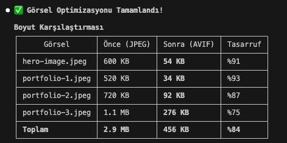

<div align="center">

  

  # Compress to AVIF

  **AI Assistant Skill - Convert images to AVIF without resizing**

  [](LICENSE)

</div>

---

## About

A skill for AI coding assistants that converts project images to AVIF format at quality 75 while preserving original resolution. Just tell your AI assistant "convert images to AVIF" and it handles the rest.

### Why AVIF?

- **50% smaller files** compared to JPEG at similar quality
- **Modern browser support** (Chrome, Firefox, Safari, Edge)
- **Royalty-free** format
- **Excellent quality** at lower bitrates

---

## Supported Agents

- Codex CLI
- Claude Code
- Gemini CLI

---

## Installation

Clone or copy this folder into the tool's skills directory:

```bash
# For Claude Code
cp -r compress-to-avif ~/.claude/skills/

# For Codex CLI
cp -r compress-to-avif ~/.codex/skills/

# For Gemini CLI
cp -r compress-to-avif ~/.gemini/skills/
```

Restart the tool so it loads the new skill.

---

## Usage

Once installed, simply ask your AI assistant:

```
"Convert my images to AVIF"
"Optimize all images in public/assets to AVIF format"
"Compress project images to AVIF at quality 80"
```

The skill will:

1. Scan your project for images
2. Create an image list JSON
3. Run the compression script
4. Generate a mapping file for reference updates

---

## How It Works

### Workflow

```
┌─────────────┐    ┌──────────────┐    ┌─────────────┐
│   Ask AI    │ -> │ Collect      │ -> │ Convert to  │
│ Assistant   │    │ Image Paths  │    │ AVIF        │
└─────────────┘    └──────────────┘    └─────────────┘
                                              │
                                              ▼
                                       ┌─────────────┐
                                       │ Update      │
                                       │ References  │
                                       └─────────────┘
```

### Image List Format

The skill creates an `image-files.json`:

```json
{
  "images": [
    "public/images/hero.jpg",
    { "path": "src/assets/card.png" }
  ]
}
```

### Mapping File Output

The generated `image-map.json` provides:

```json
{
  "generatedAt": "2025-01-14T12:00:00Z",
  "quality": 75,
  "items": [
    {
      "input": "public/images/hero.jpg",
      "output": "assets/optimized/hero.avif",
      "status": "converted",
      "sourceWidth": 1920,
      "sourceHeight": 1080
    }
  ]
}
```

---

## Options

The skill supports these parameters:

| Parameter | Description | Default |
|-----------|-------------|---------|
| `--quality` | AVIF quality (1-100) | `75` |
| `--output-dir` | Output directory | Original location |
| `--dry-run` | Preview without writing | `false` |

---

## Browser Support

AVIF is supported in all modern browsers:

| Browser | Version |
|---------|---------|
| Chrome | 85+ |
| Firefox | 93+ |
| Safari | 16+ |
| Edge | 85+ |

### Fallback Example

```html
<picture>
  <source srcset="image.avif" type="image/avif">
  
</picture>
```

---

## File Structure

```
compress-to-avif/
├── SKILL.md              # Skill definition
├── scripts/
│   └── compress_images_to_avif.py   # Core script
├── working-demo.png      # Demo screenshot
├── README.md             # This file
└── LICENSE               # MIT License
```

---

## License

MIT License - see [LICENSE](LICENSE) for details.

---

## Author

Made by [Andac](https://github.com/AndacGuven)
